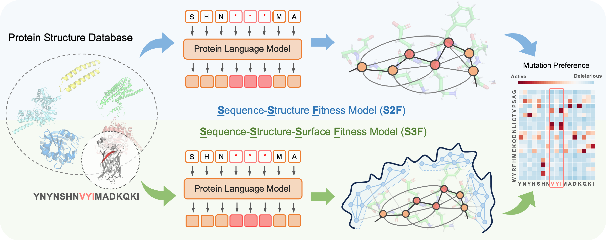

# Sequence-Structure-Surface Model for Protein Fitness Prediction (S3F)

This is the official codebase of the paper

**Multi-Scale Representation Learning for Protein Fitness Prediction**, *NeurIPS'2024*

[[ArXiv]()] [[OpenReview](https://openreview.net/forum?id=kWMVzIdCEn)]

Zuobai Zhang*, Pascal Notin*, Yining Huang, Aurelie Lozano, Vijil Chenthamarakshan, Debora Marks, Payel Das, Jian Tang

## Overview

*Sequence-Structure-Surface Fitness Model (**S3F**)* is a novel multimodal representation learning framework that integrates protein features across several scales. The model is pre-trained on the CATH dataset and evaluated by zero-shot protein fitness on [ProteinGym](https://proteingym.org/). The summary of our results on ProteinGym can be found [here](./asset/DMS_substitutions_Spearman_DMS_level.csv). The datasets and model checkpoints for this project can be downloaded from [this link](https://zenodo.org/records/14257708).



This codebase is based on PyTorch and [TorchDrug] ([TorchProtein](https://torchprotein.ai)). 

[TorchDrug]: https://github.com/DeepGraphLearning/torchdrug

## Installation

You may install the dependencies via either conda or pip. Generally, GearNet works
with Python 3.7/3.8 and PyTorch version >= 1.8.0.

### From Conda

```bash
conda install torchdrug pytorch=1.8.0 cudatoolkit=11.1 -c milagraph -c pytorch-lts -c pyg -c conda-forge
conda install easydict pyyaml -c conda-forge
```

### From Pip

```bash
pip install torch==1.8.0+cu111 -f https://download.pytorch.org/whl/lts/1.8/torch_lts.html
pip install torchdrug
pip install easydict pyyaml
```

## Evaluate on ProteinGym benchmark

### Dataset preparation 
To evaluate on ProteinGym benchmark, you need to first download datasets from the [official ProteinGym website](https://proteingym.org/).
```bash
# Download ProteinGym benchmark
wget https://marks.hms.harvard.edu/proteingym/DMS_ProteinGym_substitutions.zip -O ./dataset
unzip DMS_ProteinGym_substitutions.zip -d ./dataset/DMS_ProteinGym_substitutions
wget https://marks.hms.harvard.edu/proteingym/ProteinGym_AF2_structures.zip -O ./dataset
unzip ProteinGym_AF2_structures.zip -d ./dataset/ProteinGym_AF2_structures
```

Then, running S3F requires to first generate the surfaces based on ProteinGym structures. You can choose either to download our pre-processed version of surface graphs at [link](https://zenodo.org/records/14257708/files/processed_surface_proteingym.zip) or process surface graphs by yourself.
```bash
# Download the processed surface graphs
wget https://zenodo.org/records/14257708/files/processed_surface_proteingym.zip -P ./dataset
unzip ./dataset/processed_surface_proteingym.zip -d ./dataset

# Or process surface graphs by yourself
python script/preload_dataset.py -i ./dataset/ProteinGym_AF2_structures/ -o ./dataset/processed_proteingym/
python script/process_surface.py -i ./dataset/processed_proteingym/ -o ./dataset/processed_surface_proteingym/
```

As the model is based on the ESM-2-650M model, you need to first download the ESM model checkpoint.
```bash
mkdir -p ~/scratch/protein-model-weights/esm-model-weights/
wget https://dl.fbaipublicfiles.com/fair-esm/models/esm2_t33_650M_UR50D.pt -P ~/scratch/protein-model-weights/esm-model-weights/
```
There is a `task.model.sequence_model.path` argument in each config file to control where to automatically download ESM model weights. Please modify this to your customized path to the esm model weights.


### Evaluation

We prodive both S2F and S3F model checkpoints for evaluation. You can download these checkpoints from [link](https://zenodo.org/records/14257708) and then run the following commands for evaluation. Right now, we only support single-gpu evaluation, which takes around 20 hours for all 217 assays on one A100 GPU. The output files can be found at `~/scratch/proteingym_output`, which is specified by the `output_dir` argument in the `*.yaml`.

```bash
# Run evaluation for S2F
python script/evaluate.py -c config/evaluate/s2f.yaml --datadir ./dataset/DMS_ProteinGym_substitutions --structdir ./dataset/ProteinGym_AF2_structures --ckpt <path_to_ckpt>

# Run evaluation for S3F
python script/evaluate.py -c config/evaluate/s3f.yaml --datadir ./dataset/DMS_ProteinGym_substitutions --structdir ./dataset/ProteinGym_AF2_structures --surfdir ./dataset/processed_surface_proteingym/ --ckpt <path_to_ckpt>
```

## Pre-train on CATH dataset

### Dataset preparation 
We also provide the code for pre-training on the CATH dataset with residue type prediction objective.
To get started, you need to download a raw version from [this repo](https://github.com/tyang816/ProtSSN) and preload it with our script.
```bash
# Download raw cath dataset and process it
wget https://huggingface.co/datasets/tyang816/cath/blob/main/dompdb.tar -P ./dataset
tar -xvf dompdb.tar -C ./dataset
python script/preload_dataset.py -i ./dataset/dompdb/ -o ./dataset/processed_cath/
```

Then, to pre-train S3F, you need to first process the surface graphs for the protein. However, as the files are too large (over 150G), we cannot provide the processed version. You need to run the following command to re-process the surface graphs by yourself.
```bash
# Process surface graphs (require one GPU to compute)
python script/process_surface.py -i ./dataset/processed_cath/ -o ./dataset/processed_surface_cath/
```


### Pre-training

To pre-train the S2F or S3F models, please run the following commands. Here we use 4 A100 GPUs for training. 
```bash
# Pre-train S2F model
python -m torch.distributed.launch --nproc_per_node=4 script/pretrain.py -c config/pretrain/s2f.yaml --datadir ./dataset/processed_cath

# Pre-train S3F model
python -m torch.distributed.launch --nproc_per_node=4 script/pretrain.py -c config/pretrain/s3f.yaml --datadir ./dataset/processed_cath --surfdir ./dataset/processed_surface_cath
```

To customize your pre-training setting, you need to adapt `config/pretrain/s3f.yaml` for your setting. You can set `engine.gpus` as the devices you want to use and set `engine.batch_size` as the batch size per gpu.

## Citation
If you find this codebase useful in your research, please cite the following papers.

```bibtex
@inproceedings{zhang2022s3f,
  title={Multi-Scale Representation Learning for Protein Fitness Prediction},
  author={Zhang, Zuobai and Notin, Pascal and Huang, Yining and Lozano, Aurelie and Chenthamarakshan, Vijil and Marks, Debora and Das, Payel and Tang, Jian},
  booktitle={Advances in Neural Information Processing Systems},
  year={2024}
}
```